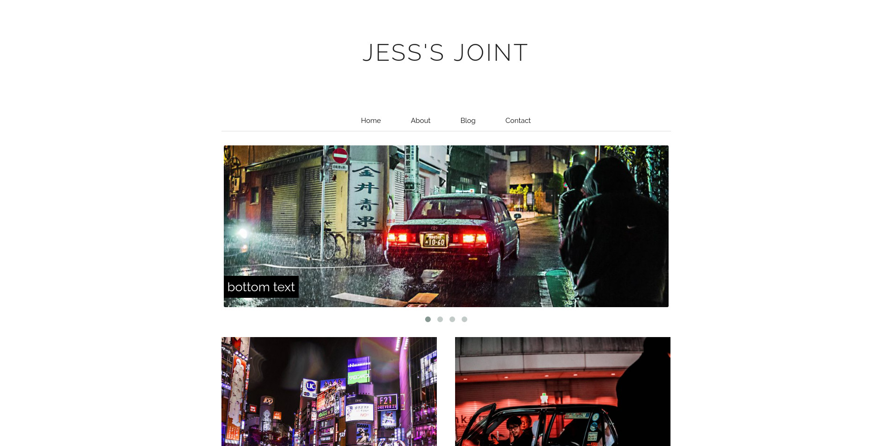

# Inbound — A Minimalist Wordpress Theme (August 2016) 
This project marks my graduation from being a One Page Wonder to Junior Wordpress Goon. Being my first attempt, there are the inevitable rough edges (not being able to directly choose what posts are displayed on the homepage for example) and for the purposes of a simple blog site it's all functional. 

## Installation
Standard installation of every other Wordpress theme; nothing fancy. 

1. Place the contents of this repository into a new directory in your `wp-content/themes` of your Wordpress folder.
1. Go to Appearance -> Themes and activate the theme. 

